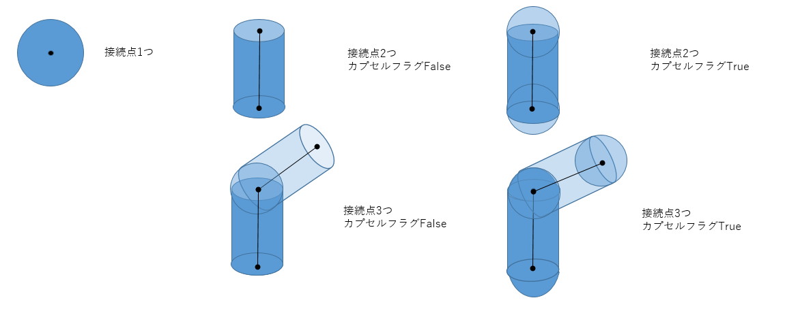
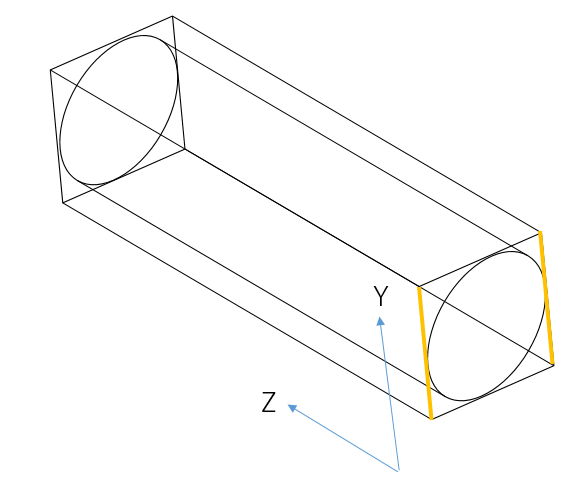
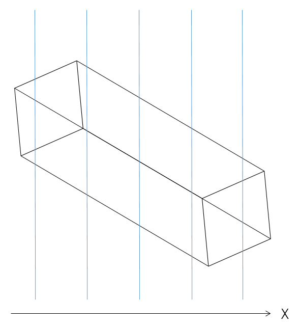
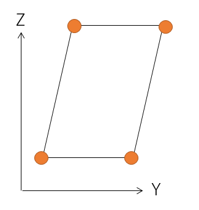
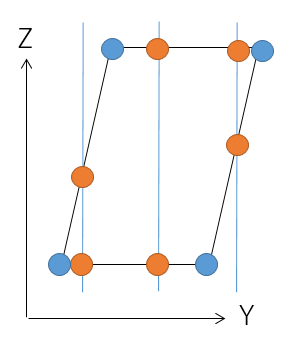
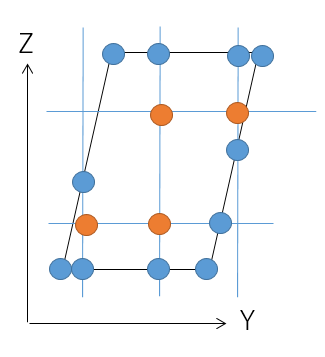
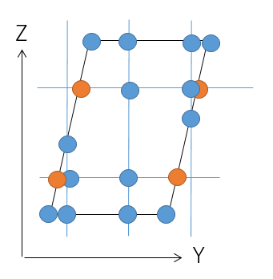
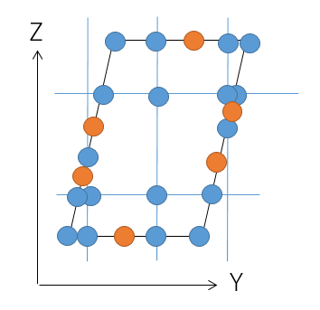
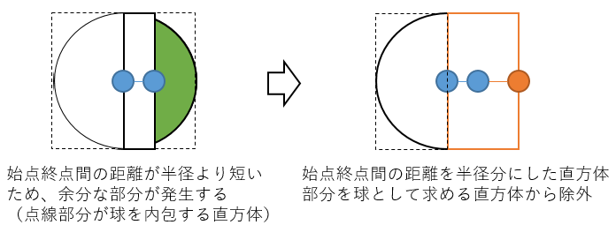

# 設計資料    

本資料では同モジュール内で提供される下記APIについて記載をする。 
- 指定範囲の空間ID変換（円柱）

## 指定範囲の空間ID変換（円柱）

### 更新履歴 
<table border=1>
<header>
<td width=13%>
版数
</td>
<td width=10%>
日付
</td>
<td>
概要
</td>
<td width=18%>
更新者
</td>
</header>
<tr>
<td>0.01</td>
<td>2022/06/09</td>
<td>新規作成</td>
<td>田中</td>
</tr>
<tr>
<tr>
<td>0.02</td>
<td>2022/06/21</td>
<td>
<ul>
<li>座標変換をAPIで行う旨を削除</li>
<li>立方体を直方体に修正</li>
<li>ValueErrorを例外に変更</li>
<li>水平方向精度のボクセルの大きさ取得を削除</li>
<li>垂直方向精度のボクセルの大きさ取得を削除</li>
<li>変換する座標を記載</li>
<li>余分なボクセルの除外(円柱の接続点)を記載</li>
<li>ボクセル境界面を軸平行から緯度経度平行に変更</li>
<li>線上のボクセル境界面を無視する記述を削除</li>
</ul>
</td>
<td>田中</td>
</tr>
<tr>
<td>0.03</td>
<td>2022/06/24</td>
<td>
<ul>
<li>直方体の横の辺をYZ平面と水平にする旨を記載</li>
<li>ESPG:6667の記載を削除</li>
<li>ボクセル境界面の緯度経度高さの記述を改善</li>
<li>緯度、高さ境界ボクセルの取得処理をループの外へ移動</li>
<li>座標変換の説明の二重記載を削除</li>
</ul>
</td>
<td>田中</td>
</tr>
<tr>
<td>0.04</td>
<td>2022/06/28</td>
<td>
<ul>
<li>処理概要を記載</li>
<li>制限事項を記載</li>
<li>処理順序に改行を追加</li>
<li>更新履歴の順序を変更</li>
<li>CRSの計算式について、文言のみ修正</li>
<li>②の重複部分を③に変更</li>
<li>円柱の空間ボクセル簡易取得について、文言修正</li>
<li>高さボクセル辺との交点の取得の誤記（緯度→高さ）を修正</li>
<li>直方体について、二重記載を削除</li>
</ul>
</td>
<td>田中</td>
</tr>
<tr>
<td>0.05</td>
<td>2022/07/19</td>
<td>
<ul>
<li>空間IDで使用する座標を3857に変更</li>
<li>緯度経度高さでの分割からXYZでの分割へ変更</li>
</ul>
</td>
<td>田中</td>
</tr>
<tr>
<td>0.06</td>
<td>2022/07/19</td>
<td>
<ul>
<li>境界面を2次元上の線分ではなく平面に変更</li>
</ul>
</td>
<td>田中</td>
</tr>
<tr>
<td>0.07</td>
<td>2022/07/29</td>
<td>
<ul>
<li>処理の参照位置が異なっているため、修正</li>
</ul>
</td>
<td>田中</td>
</tr>
<tr>
<td>0.08</td>
<td>2022/08/5</td>
<td>
<ul>
<li>ループ処理の開始を具体的な処理に修正</li>
</ul>
</td>
<td>田中</td>
</tr>
<tr>
<td>0.09</td>
<td>2022/08/9</td>
<td>
<ul>
<li>参照先の節タイトルを記載</li>
</ul>
</td>
<td>田中</td>
</tr>
<tr>
<td>0.10</td>
<td>2022/08/10</td>
<td>
<ul>
<li>制限事項を追加</li>
</ul>
</td>
<td>田中</td>
</tr>
<tr>
<td>0.11</td>
<td>2022/08/18</td>
<td>
<ul>
<li>PDF化のため、改行を1行追加</li>
<li>座標を保持する箇所が冗長であるため、削除</li>
</ul>
</td>
<td>田中</td>
</tr>
</tr>
<tr>
<td>0.12</td>
<td>2022/08/19</td>
<td>
<ul>
<li>球体、カプセル、円柱のイメージを画像として追加</li>
<li>処理の目的を追記</li>
</ul>
</td>
<td>田中</td>
</tr>
</table>

### 処理概要
入力として、複数の円柱の接続点、半径、CRS、水平精度、垂直精度、カプセルフラグが与えられる。
接続点数が1のときは、球体が重なる空間IDを返却する。球体は接続点を中心とし、半径で指定された球体を対象とする。
接続点数が0のときは、戻り値として空配列を返却する。
接続点数が2以上、かつカプセルフラグがFalseの場合は、円柱と球体が重なる空間IDを返却する。円柱は円柱の接続点の連続する2つの点を中心線とし、半径の値で表現されたものを対象とする。球体は接続点を中心とし、半径で指定された球体を対象とする。
接続点数が2以上、かつカプセルフラグがTrueの場合は、円柱を両端を半球上としたカプセルとして扱う。カプセルは円柱の接続点の連続する2つの点を中心線とし、入力された半径で指定されたものを対象とする。
空間ID変換で例外が発生した場合は、発生した例外を呼び出し元に投げる。
 

### 処理順序
1. 入力チェック  
半径が0以下の場合は、例外を投げる。  
1. 複数の円柱が含まれる範囲の空間IDの取得  
入力された1つ１つの円柱について、それぞれ重なる空間IDを取得する。
入力された円柱の中心の接続点配列をイテレータとして、最後の前のインデックスまでループ処理を開始する。ただし、同じ座標が連続している場合は、同じ座標を無視する。
    <ol style="list-style-type: upper-roman">
        <li>始点と終点の設定 
        地理座標から投影座標への変換を用いて始点、終点に対し、入力されたCRSの座標系から空間IDで使用する座標系(EPSG:3857)に座標変換する。  </li>
        <li>始点、終点間のオブジェクトを内包する直方体の設定 
        円柱が重なる可能性がある範囲にいて、円柱を内包する直方体の範囲として絞り込む。
        始点と終点の中点を中心点とする以下の表のような直方体を設定する。オブジェクトの中心は終点始点間の中点とする。座標変換に失敗した場合は例外を呼び出し元に投げる。
        <table>
        <tr><td></td><td>円柱</td><td>カプセル</td><td>球（円柱の接続点）</td></tr>
        <tr><td>縦</td><td>始点から終点</td><td>始点から終点＋半径×2</td><td>半径×2</td></tr>
        <tr><td>横</td><td>半径×2</td><td>半径×2</td><td>半径×2</td></tr>
        <tr><td>高さ</td><td>半径×2</td><td>半径×2</td><td>半径×2</td></tr></table>
        円柱の場合は、以下のような直方体となる。 横の辺はYZ平面と水平とする。 
          
        </li>
        </li>
        <li>直方体の辺が含まれる範囲の空間IDの取得 
        各軸の空間ボクセル境界面を絞り込むため、直方体の辺が含まれる範囲の空間IDを取得する。
        直方体の各辺をイテレータとしてループ処理を開始する。
        <ol style="list-style-type: lower-roman">
            <li>辺が含まれる空間IDの取得 
            辺に対し、処理順序(線分)の処理を行う。  </li>
        </ol>
        </li>
        <li>X方向ボクセル境界面の取得 
        直方体が接触している空間ボクセルを絞り込むためにX方向ボクセル境界面を取得する。
        直方体の辺が含まれる空間IDの空間ボクセル頂点からX座標を抜き出し、X方向ボクセル境界面とする。  
          </li>
        <li>Y方向ボクセル境界面の取得 
        直方体が接触しているボクセルを絞り込むためにY方向ボクセル境界面を取得する。
        直方体の辺が含まれる空間IDの空間ボクセル頂点からY座標を抜き出し、Y方向ボクセル境界面とする。  
        </li>
        <li>Z方向ボクセル境界面の取得 
        直方体が接触している空間ボクセルを絞り込むためにZ方向ボクセル境界面を取得する。
        直方体の辺が含まれる空間IDの空間ボクセル頂点からZ座標を抜き出し、Z方向ボクセル境界面とする。  
        </li>
        <li>X方向ボクセル境界面の空間ID取得 
        X方向ボクセル境界面の断面におけるY方向ボクセル境界面とZ方向ボクセル境界面との接触点を交点として抽出し、交点とその中点から空間IDを取得する。
        X方向ボクセル境界面配列をイテレータとしてループ処理を開始する。
        <ol style="list-style-type: lower-roman">
            <li>X方向ボクセル境界面と線の交点の取得 
            各辺について、X方向ボクセル境界面との交点①を求める。指定範囲の空間ID変換（線分）の4.X方向ボクセル境界面の取得の処理を参照のこと。 
              </li>
            <li>Y方向ボクセル辺との交点の取得 
            交点①をY方向ボクセル境界面毎に交点①を結んだ線の交点のZ座標が最大値、最小値の2点の交点②を取得する。 
              </li>
            <li>空間ボクセル頂点との交点の取得 
            Z方向ボクセル境界面毎に交点②を結んだ線の交点のY座標が最大値、最小値の2点の交点③を取得する。 
              </li>
            <li>Z方向ボクセル辺との交点の取得 
            Z方向ボクセル境界面毎に交点①を結んだ線の交点のY座標が最大値、最小値の2点の交点④を取得する。 
              </li>
            <li>中点の取得 
            下図のオレンジ部分のボクセルが範囲外になってしまうため、交点①を結んだ線毎の交点②、交点④の中点を取得する。 
              </li>
            </li>
        </ol>
        </li>
        <li>Y方向ボクセル境界面、Z方向境界面処理 
        X方向ボクセル境界面に交わらない直方体も考慮するため、Y方向ボクセル境界面、Z方向ボクセル境界面との交点も取得する。
        Ⅶ.X方向ボクセル境界面の空間ID取得の処理をY方向ボクセル境界面、Z方向境界面にも同様に行う。  </li>
        <li>直方体の空間ボクセル取得 
        上記のループ内の交点①、交点②、交点③、交点④、中点が含まれる空間ボクセルを取得する。  </li>
        <li>余分なボクセルの除外(円柱の接続点) 
        円柱の接続点である球の場合、かつ前方の円柱の始点と終点の距離が半径より短い場合、円柱の終点から始点方向へ半径の距離を伸ばした直方体を作る。直方体が存在する空間ボクセルを求め、球が存在する空間ボクセルから除外する。 
        円柱の接続点である球の場合、かつ後方の円柱の始点と終点の距離が半径より短い場合、円柱の始点から終点方向へ半径の距離を伸ばした直方体を作る。直方体が存在する空間ボクセルを求め、球が存在する空間ボクセルから除外する。 
          
        </li>
        <li>始点終点間の空間ID取得 
        円柱の空間ボクセル簡易取得において、円柱の中心線が含まれる空間ボクセルから一定の距離にある空間ボクセルを円柱に含まれるとすることで、衝突判定の計算回数を減らす。ここでは、中心線が含まれる空間ボクセルを求める。 
        概算距離の基準ボクセルとするため、始点終点間の空間IDを取得する。 
        始点、終点を結んだ直線が存在する空間ボクセルを取得する。処理順序(線分)を参照のこと。  
        <li>空間ボクセルの概算距離の算出 
        円柱の中心線が含まれる空間ボクセルから一定の距離にある空間ボクセルであるか判定するため、空間ボクセルとの概算距離を求める。 
        空間ボクセルの対角線上の距離を概算距離とする。  </li>
        <li>円柱の空間ボクセル簡易取得 
        空間ボクセル1つの距離を概算距離とし、直方体の空間ボクセルである、かつ始点、終点を結んだ直線が存在する空間ボクセルから半径よりも離れていない空間ボクセルを円柱の空間ボクセルとする。  </li>
        <li>円柱の空間ボクセル取得 
        直方体の空間ボクセル、かつ円柱の空間ボクセル簡易取得で取得されなかった空間ボクセルを対象に、pybulletを用いて衝突判定を行う。円柱の空間ボクセル簡易取得できた空間ボクセルと衝突判定で衝突すると判定された空間ボクセルを円柱の空間ボクセルとする。  
        </li>
        <li>円柱の空間ID取得 
        地理座標から投影座標への変換を用いて、円柱の空間ボクセルを緯度経度高さ(EPSG:4326)に変換後、指定点から空間IDへの変換(点群)を用いて空間IDに変換する。座標変換に失敗した場合は例外を呼び出し元に投げる。  
        </li>
    </ol>
1. 接続点の空間IDの取得  
円柱の場合、最初と最後を除いた接続点について、球の空間IDを取得する。カプセルの場合は、取得しない。
球の空間IDは、接続点を中心として、2.II.始点、終点間のオブジェクトを内包する直方体の設定～2.XV.円柱の空間ID取得の処理を行うことで取得する。
接続点が1つの場合も、球の空間IDを取得する。  
1. 返却値の設定  
全ての円柱、球の空間IDを重複がない状態で返却する。  

### 制限事項
- 円柱を構成する中心線の端点は西側から東側に繋いだ線分として解釈する
- 経度180度をまたがるオブジェクトについては未対応

## 使用ライブラリ

### 更新履歴 
<table border=1>
<header>
<td width=13%>
版数
</td>
<td width=10%>
日付
</td>
<td>
概要
</td>
<td width=18%>
更新者
</td>
</header>
<tr>
<td>0.01</td>
<td>2022/06/9</td>
<td>新規作成</td>
<td>田中</td>
</tr>
<tr>
<td>0.02</td>
<td>2022/06/21</td>
<td>
<ul>
<li>pybulletのpythonバージョンを修正</li>
<li>pyprojectを追加</li>
<li>numpyを追加</li>
<li>scikit-spatialを追加</li>
</ul>
</td>
<td>田中</td>
</tr>
<tr>
<td>0.03</td>
<td>2022/06/29</td>
<td>
<ul>
<li>pyprojectをpyprojに修正</li>
</ul>
</td>
<td>田中</td>
</tr>
</table>

- pybullet  
    - バージョン:3.2.5
    - pythonバージョン:&gt;=3.4
    - 確認日:2022/6/7
    - 用途:円柱と空間ボクセルの衝突確認に使用する
- pyproj
    - バージョン:3.3.1
    - pythonバージョン:&gt;=3.8
    - 確認日:2022/6/21
    - 座標変換に使用する
- numpy  
    - バージョン:1.22.4 
    - pythonバージョン:&gt;=3.8
    - 確認日:2022/6/21
    - 行列演算に使用する
- scikit-spatial  
    - バージョン:6.4.0
    - pythonバージョン:&gt;=3.7
    - 確認日:2022/6/21
    - 線分の演算に使用する