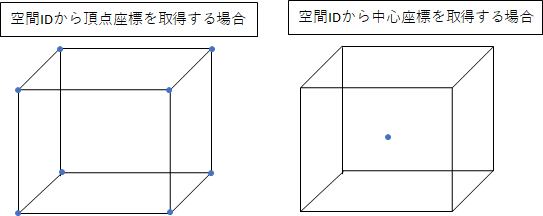
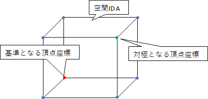

# 設計資料    

本資料ではpoint.pyモジュール内で提供される下記、関数について記載をする。  
- 地理座標から空間IDへの変換(点群)
- 空間IDから地理座標、または、投影座標への変換
- 地理座標から投影座標への変換
- 投影座標から地理座標への変換
- 精度の入力制限の確認

## 地理座標から空間IDへの変換(点群)

### 更新履歴 
<table border=1>
<header>
<td width=13%>
版数
</td>
<td width=10%>
日付
</td>
<td>
概要
</td>
<td width=18%>
更新者
</td>
</header>
<tr>
<td>0.01</td>
<td>2022/5/30</td>
<td>新規作成</td>
<td>嶋津</td>
</tr>
<tr>
<td>0.02</td>
<td>2022/6/16</td>
<td>文言修正 不要な記載の削除</td>
<td>嶋津</td>
</tr>
<tr>
<td>0.03</td>
<td>2022/6/27</td>
<td>処理概要の追加</td>
<td>嶋津</td>
</tr>
<tr>
<td>0.04</td>
<td>2022/7/3</td>
<td>高さの位置取得仕様を修正</td>
<td>嶋津</td>
</tr>
<tr>
<td>0.05</td>
<td>2022/7/11</td>
<td>I. 座標の変換に入力値チェックの追加</td>
<td>嶋津</td>
</tr>
<tr>
<td>0.06</td>
<td>2022/7/22</td>
<td>インデックスの計算式を修正</td>
<td>嶋津</td>
</tr>
<td>0.07</td>
<td>2022/8/02</td>
<td>割り算の記号が「/」と「÷」で混在していたため、「÷」で統一。</td>
<td>嶋津</td>
</tr>
<tr>
<td>0.08</td>
<td>2022/8/17</td>
<td>
水平方向の分解能に関する記載を削除。 
垂直方向の分解能の計算式を修正
入力チェックの記載を追加
</td>
<td>嶋津</td>
</tr>
<tr>
<td>0.09</td>
<td>2022/8/22</td>
<td>
項目タイトルの修正 
処理概要に図の追加
</td>
<td>嶋津</td>
</tr>
</table>

### 処理概要
地理座標が格納されたデータクラスオブジェクトを引数に空間IDを返却する。  
  
図のような点群データが与えられた場合、空間ID Aで囲まれた範囲の地理座標はすべて同じ空間IDとなる。

### 処理順序

1. 座標の変換オブジェクトの作成  
ユーザの入力したCRSをWGS84のCRS(EPSG:4326)に変換するオブジェクトを作成する。
存在しないCRSコードが入力された場合は、エラーとする。
オブジェクトの作成の前に、精度の入力チェックを実行する。

1. 入力地理座標リストループ処理の開始  
入力された地理座標のオブジェクトのリストをイテレータとしてループ処理を開始する。
    <ol style="list-style-type: upper-roman">
        <li>
        座標の変換 
        計算した座標が経度、緯度を超えていないかチェックをする。 
        経度緯度を超えていた場合はエラーとする。 
        イテレータから取り出した座標を空間座標(EPSG:4326)の座標に変換し、①とする。  
        </li>
        変換に失敗した場合は変換エラーとする。
        ユーザから入力されたCRSがWGS84の場合、変換処理はスキップする。
        <li>
        水平方向のタイルIDの作成
        <ol style="list-style-type: lower-roman">
            <li>
            下記の計算式から、経度と緯度の位置を取得する。
            </li>
            <B>
            経度の位置 
            floor((2^精度) × ((①の経度 + 180) ÷ 360)) 
            緯度の位置 
            floor((2^精度) × (1 - log(tan(radians(①の緯度)) + (1 ÷ cos(radians(①の緯度)))) ÷ π) ÷ 2)  
            </B>
            <li>
            精度と計算結果を組み合わせて、水平方向のタイルIDを作成する。
            </li>
            <B>
            [精度]/[経度の位置]/[緯度の位置]
            </B>
        </ol>
        <li>
        垂直方向のタイルIDの作成
        <ol style="list-style-type: lower-roman">
        <li>
        入力された精度ごとの分解能を取得する。 
        <B>
        分解能：2^25 ÷ 2^精度
        </B>
        </li>
        <B>
        高さの位置:floor(①の高さ÷分解能)
        </B>
        <li>
        垂直方向のタイルIDを作成する。
        </li>
        <B>
        [垂直精度]/[高さの位置]
        </B>
        </ol>
    <li>    
    空間IDの作成 
    水平方向のタイルIDと垂直方向のタイルIDを「/」で結合し、空間IDとして返却用リストに格納する。 
    <B>
    [精度]/[経度の位置]/[緯度の位置]/[精度]/[高さの位置] 
    </B>
    </li>
    </ol>
1. ループ処理の終了  
返却用リストを返却する。

## 空間IDから地理座標、または、投影座標への変換

### 更新履歴 
<table border=1>
<header>
<td width=13%>
版数
</td>
<td width=10%>
日付
</td>
<td>
概要
</td>
<td width=18%>
更新者
</td>
</header>
<tr>
<td>0.01</td>
<td>2022/5/31</td>
<td>新規作成</td>
<td>嶋津</td>
</tr>
<tr>
<td>0.02</td>
<td>2022/6/16</td>
<td>文言修正 不要な記載の削除 座標の変換タイミングを座標の計算前に変更</td>
<td>嶋津</td>
</tr>
<tr>
<td>0.03</td>
<td>2022/6/27</td>
<td>処理概要の追加</td>
<td>嶋津</td>
</tr>
<tr>
<td>0.04</td>
<td>2022/6/29</td>
<td>4. 座標の作成に入力値チェックの追加</td>
<td>嶋津</td>
</tr>
<td>0.05</td>
<td>2022/7/05</td>
<td>高さの仕様変更に伴う修正</td>
<td>嶋津</td>
</tr>
<tr>
<td>0.06</td>
<td>2022/7/22</td>
<td>
インデックスの計算式を修正 
座標取得の方法を外部ライブラリを使用する方法に修正
</td>
<td>嶋津</td>
</tr>
<tr>
<td>0.07</td>
<td>2022/8/17</td>
<td>
空間IDから座標取得の計算を修正 
外部ライブラリ(pyquadkey2)の削除
</td>
<td>嶋津</td>
</tr>
<tr>
<td>0.08</td>
<td>2022/8/22</td>
<td>
項目タイトルの修正 
処理概要に図の追加</td>
<td>嶋津</td>
</tr>
</table>

### 処理概要
入力された空間IDから外部ライブラリを用いて水平方向の各座標を取得する。取得した座標から、その空間IDのボクセルの中心の座標、もしくは頂点の座標のリストを取得する。
  
また、頂点座標については水平方向と高さ方向に最小の座標となる頂点を基準とする。
基準となる頂点座標を空間ID Aとした場合、基準となる頂点座標の対極の位置にある頂点座標を空間IDに変換すると、空間ID Aのインデックス値がすべて「1」増加した空間IDとなる。  

### 処理順序
1. 空間IDの分解  
入力された空間IDリストを水平方向のタイルIDと高さ方向のタイルIDに分割する。  
分解した成分から取得した精度の入力チェックを実行する。  
    <ol style="list-style-type: upper-roman">
        <li>
        水平方向のタイルIDは下記の成分に分解する。
        </li>  
        - 水平方向精度   
        - 経度の位置  
        - 緯度の位置 
        <li>
        垂直方向のタイルIDは下記の成分に分解する。  
        </li>
        - 垂直方向精度 
        - 高さの位置 
    </ol>

1. 垂直方向の座標計算
    <ol style="list-style-type: upper-roman">
    <li>
    入力された精度ごとの分解能から高さを取得する。 
    <B>
    分解能： 2^25 ÷ 2^精度
    </B>
    </li>
    <B>
    高さ = 高さの位置 × 分解能
    </B>
    </li>
    </ol>

1. 中心点、または、頂点の座標の計算  
どちらを取得するかはオプションにより分岐をする。  
存在しないオプションが指定された場合はエラーとする。

   <ol style="list-style-type: upper-roman">
    <li>
    頂点の座標の計算 
    下記の8個の頂点を取得する。 
    <B>
    最小緯度: degrees(atan(sinh(π × (1 - 2 × 緯度の位置 + 1 ÷ 2.0^精度)))) 
    最大緯度: degrees(atan(sinh(π × (1 - 2 × 緯度の位置 ÷ 2.0^精度)))) 
    最小経度: 経度の位置 × 360 ÷ 2^精度 - 180 
    最大経度: (経度の位置 + 1) × 360 ÷ 2^精度 - 180 
    最小の高さ: 2.Iの高さ 
    最大の高さ: 2.Iの高さ + 分解能 
    </B>
    上記の座標を組み合わせて頂点の座標とする。最大となる座標は隣り合う空間IDの最小の座標になる。
    </li>
    <li>
    中心点の座標の計算 
    <B>
    中心点の経度: (空間IDの頂点座標の最大経度 + 空間IDの頂点座標の最小経度) ÷ 2 
    中心点の緯度: (空間IDの頂点座標の最大緯度 + 空間IDの頂点座標の最小緯度) ÷ 2 
    中心点の高さ: 2.Iの高さ + 分解能 ÷ 2 
    </B>
    </li>
   </ol>

1. 座標の返却  
3.で作成した座標をデータクラスに格納し、返却する。

## 投影座標から地理座標への変換

### 更新履歴 
<table border=1>
<header>
<td width=13%>
版数
</td>
<td width=10%>
日付
</td>
<td>
概要
</td>
<td width=18%>
更新者
</td>
</header>
<tr>
<td>0.01</td>
<td>2022/7/11</td>
<td>新規作成</td>
<td>嶋津</td>
</tr>
<tr>
<td>0.02</td>
<td>2022/8/04</td>
<td>文末の文言を統一</td>
<td>嶋津</td>
</tr>
</table>

### 処理概要
投影座標が格納されたデータクラスオブジェクトとその投影座標のEPSGコードを引数に地理座標のリストを返却する。  
入力された投影座標のオブジェクトのリストをWGS84の地理座標のオブジェクトのリストに変換する。

### 処理順序
1. 入力値チェック
入力されたEPSGコードが投影座標系ではない場合、エラーとする。
入力されたEPSGコードが存在しない場合、エラーとする。
エラーが発生しない場合、pyprojのtransformerオブジェクトを作成する。

1. 変換の実行
入力されたオブジェクトのリストをイテレータとして取り出した座標を一つずつ変換する。
変換結果が「Inf」の場合、エラーとする。

1. 変換結果を変換用リストオブジェクトに格納し返却する。

## 地理座標から投影座標への変換

### 更新履歴 
<table border=1>
<header>
<td width=13%>
版数
</td>
<td width=10%>
日付
</td>
<td>
概要
</td>
<td width=18%>
更新者
</td>
</header>
<tr>
<td>0.01</td>
<td>2022/7/11</td>
<td>新規作成</td>
<td>嶋津</td>
</tr>
<tr>
<td>0.02</td>
<td>2022/7/22</td>
<td>地理座標の入力方法を変更</td>
<td>嶋津</td>
</tr>
<tr>
<td>0.03</td>
<td>2022/8/04</td>
<td>文末の文言を統一</td>
<td>嶋津</td>
</tr>
</table>

### 処理概要
地理座標が格納されたデータクラスオブジェクト、変換元の地理座標のEPSGコード、変換先の投影座標のEPSGコードを引数に投影座標のオブジェクトのリストを返却する。  

### 処理順序
1. 入力値チェック
入力された変換先のEPSGコードが投影座標系ではない場合、エラーとする。
入力された変換元のEPSGコードが地理座標系ではない場合、エラーとする。
入力されたEPSGコードが存在しない場合、エラーとする。
エラーが発生しない場合、pyprojのtransformerオブジェクトを作成する。

1. 変換の実行
入力されたオブジェクトのリストをイテレータとして取り出した座標を一つずつ変換する。
変換結果が「Inf」の場合、エラーとする。

1. 変換結果を変換用リストオブジェクトに格納し返却する。

## 投影座標から地理座標への変換

### 更新履歴 
<table border=1>
<header>
<td width=13%>
版数
</td>
<td width=10%>
日付
</td>
<td>
概要
</td>
<td width=18%>
更新者
</td>
</header>
<tr>
<td>0.01</td>
<td>2022/7/11</td>
<td>新規作成</td>
<td>嶋津</td>
</tr>
<tr>
<td>0.02</td>
<td>2022/7/22</td>
<td>地理座標の入力方法を変更</td>
<td>嶋津</td>
</tr>
<tr>
<td>0.03</td>
<td>2022/8/04</td>
<td>文末の文言を統一</td>
<td>嶋津</td>
</tr>
</table>

### 処理概要
投影座標が格納されたデータクラスオブジェクト、変換元の投影座標のEPSGコード、変換先の地理座標のEPSGコードを引数に地理座標のオブジェクトのリストを返却する。  

### 処理順序
1. 入力値チェック
入力された変換先のEPSGコードが地理座標系ではない場合、エラーとする。
入力された変換元のEPSGコードが投影座標系ではない場合、エラーとする。
入力されたEPSGコードが存在しない場合、エラー
エラーが発生しない場合、pyprojのtransformerオブジェクトを作成する。とする。

1. 変換の実行
入力されたオブジェクトのリストをイテレータとして取り出した座標を一つずつ変換する。
変換結果が「Inf」の場合、エラーとする。

1. 変換結果を変換用リストオブジェクトに格納し返却する。

## 精度の入力制限の確認

### 更新履歴 
<table border=1>
<header>
<td width=13%>
版数
</td>
<td width=10%>
日付
</td>
<td>
概要
</td>
<td width=18%>
更新者
</td>
</header>
<tr>
<td>0.01</td>
<td>2022/8/03</td>
<td>新規作成</td>
<td>嶋津</td>
</tr>

</table>

### 処理概要
ユーザから入力された精度がライブラリで表現可能な範囲かチェックをする。
入力可能な精度の範囲は、水平方向と垂直方向で共通である。

### 処理順序
1. 入力値チェック
ユーザからの入力値が0以上35以下の場合はTrueを返却する。
ユーザからの入力値が0未満、または35より大きい場合はFalseを返却する。

## 制約事項

### 更新履歴 
<table border=1>
<header>
<td width=13%>
版数
</td>
<td width=10%>
日付
</td>
<td>
概要
</td>
<td width=18%>
更新者
</td>
</header>
<tr>
<td>0.01</td>
<td>2022/8/02</td>
<td>
制約事項に更新履歴の追加 
緯度に関する制約を追加
経度に関する制約を追加
精度に関する制約を追加
</td>
<td>嶋津</td>
</tr>
<tr>
<td>0.02</td>
<td>2022/8/03</td>
<td>
文末に改ページの追加
</td>
<td>嶋津</td>
</tr>
<tr>
<td>0.03</td>
<td>2022/8/04</td>
<td>
句読点の追加
</td>
<td>嶋津</td>
</tr>
<tr>
<td>0.04</td>
<td>2022/8/17</td>
<td>
緯度の小数点以下の有効桁数の記載を追加 
pyquadkey2の記載を削除 
</td>
<td>嶋津</td>
</tr>
<tr>
<td>0.05</td>
<td>2022/8/22</td>
<td>
空間IDから頂点、または中心点の座標を取得時のCRSに関する制約を追加 
一部、文言の見直し 
精度の入力可能範囲を修正
</td>
<td>嶋津</td>
</tr>
</table>

<ul>
<li>
高さの変換を実施する際は、既定の計算式を使用する。
</li>
<li>
投影座標から空間IDを取得する場合は、変換関数を使用後、任意の関数を呼び出す。
</li>
<li>
指定可能な精度の範囲は、0から35とする。（精度26で水平方向はおよそ0.6m、垂直方向は0.5m程度の分解能）
</li>
<li>
緯度の限界値はZFXY形式で使用されるWebメルカトルに合わせ、緯度は±85.0511287798の範囲内とする。 
緯度は小数点以下の有効数字を10桁とする。11桁以降は切り捨てるものとする。
</li>
<li>
経度の限界値は±180であるが、180と-180は同じ個所を指すこととZFXY形式のインデックスの考え方により、180はライブラリ内部では-180として扱う。(180の入力は可能とする。)
</li>
<li>
空間IDから各座標を取得する場合、出力する空間座標系(CRS)は下記から選ぶこととする。 
<table border=1>
<tr>
<td>空間参照系(CRS)</td><td>EPSGコード</td>
</tr>
<tr>
<td>WGS84(GPS)</td><td>4326</td>
</tr>
<tr>
<td>日本測地系(2011)</td><td>6668</td>
</tr>
<tr>
<td>日本測地系(2011) + (高さ)</td><td>6697</td>
</tr>
<tr>
<td>日本測地系(2000)</td><td>4612</td>
</tr>
<tr>
<td>日本測地系(1892)</td><td>5132</td>
</tr>
<tr>
<td>Webメルカトル</td><td>3857</td>
</tr>
<tr>
<td>平面直角座標系</td><td>6669〜87</td>
</tr>
</table>
</li>

## 使用ライブラリ

### 更新履歴 
<table border=1>
<header>
<td width=13%>
版数
</td>
<td width=10%>
日付
</td>
<td>
概要
</td>
<td width=18%>
更新者
</td>
</header>
<tr>
<td>0.01</td>
<td>2022/5/30</td>
<td>新規作成</td>
<td>嶋津</td>
</tr>
<tr>
<td>0.02</td>
<td>2022/6/27</td>
<td>numpyの削除</td>
<td>嶋津</td>
</tr>
<tr>
<td>0.03</td>
<td>2022/7/22</td>
<td>pyquadkey2の追加</td>
<td>嶋津</td>
</tr>
<tr>
<td>0.04</td>
<td>2022/8/17</td>
<td>pyquadkey2の削除</td>
<td>嶋津</td>
</tr>

</table>

- pyproj  
    - バージョン:3.3.1
    - pythonバージョン:&gt;=3.8
    - 確認日:2022/5/30
    - 用途:空間座標系の変換に使用する。

