# 設計資料    

本資料では同モジュール内で提供される下記APIについて記載をする。 
指定範囲の空間ID変換（線分）については、内部関数とする。 
- 指定範囲の空間ID変換（ポリゴン）
- 指定範囲の空間ID変換（線分）

## 指定範囲の空間ID変換（ポリゴン）

### 更新履歴 
<table border=1>
<header>
<td width=13%>
版数
</td>
<td width=10%>
日付
</td>
<td>
概要
</td>
<td width=18%>
更新者
</td>
</header>
<tr>
<td>0.01</td>
<td>2022/06/07</td>
<td>新規作成</td>
<td>田中</td>
</tr>
<tr>
<td>0.02</td>
<td>2022/06/21</td>
<td>
<ul>
<li>座標変換をAPIで行う旨を削除</li>
<li>変換する座標を記載</li>
<li>ボクセル境界面を軸平行から緯度経度平行に変更</li>
<li>線上のボクセル境界面を無視する記述を削除</li>
<li>線は最大値と最小値の点を使用するように修正</li>
<li>内側判定の計算方法を追加</li>
<li>内側判定の辺と交差した場合を追加</li>
<li>内外判定対象空間ID取得の記載を修正</li>
<li>内外判定にWinding Number Algorithmを記載</li>
<li>判定結果の取得先の誤記を修正</li>
</ul>
</td>
<td>田中</td>
</tr>
<tr>
<td>0.03</td>
<td>2022/06/23</td>
<td>
<ul>
<li>ESPG:6667の記載を削除</li>
<li>最後の前のインデックスまでの記載を削除</li>
<li>CRSの計算箇所を1箇所に変更</li>
<li>上長である3点交点がある場合の記載を削除</li>
<li>点、辺と衝突した場合の計算方法を追記</li>
</ul>
</td>
<td>田中</td>
</tr>
<tr>
<td>0.04</td>
<td>2022/06/24</td>
<td>
<ul>
<li>判定結果の取得先の誤記を修正</li>
<li>線を結ぶ際のパターンを記載</li>
</ul>
</td>
<td>田中</td>
</tr>
<tr>
<td>0.05</td>
<td>2022/06/28</td>
<td>
<ul>
<li>処理概要を記載</li>
<li>制限事項を記載</li>
<li>処理順序に改行を追加</li>
<li>更新履歴の順序を変更</li>
</ul>
</td>
<td>田中</td>
</tr>
<tr>
<td>0.06</td>
<td>2022/06/29</td>
<td>
<ul>
<li>辺を共有する場合の内外判定を記載</li>
<li>三角ポリゴンをXY平面に投影したとき、直線になるケースの処理を記載</li>
<li>制限事項に「隣接する三角形が頂点を共有していない」を追加</li>
<li>制限事項に該当する線を結ぶパターンを削除</li>
<li>CRSの計算式について、文言のみ修正</li>
</ul>
</td>
<td>田中</td>
</tr>
<td>0.07</td>
<td>2022/07/05</td>
<td>
<ul>
<li>辺を共有する場合の内外判定で交点が頂点上にある場合の処理を追記</li>
</ul>
</td>
<td>田中</td>
</tr>
<tr>
<td>0.08</td>
<td>2022/07/13</td>
<td>
<ul>
<li>内外判定に辺共有、点共有の場合の処理を記載</li>
<li>内外判定に2辺、1辺1頂点、2頂点との衝突を記載</li>
</ul>
</td>
<td>田中</td>
</tr>
<tr>
<td>0.09</td>
<td>2022/07/19</td>
<td>
<ul>
<li>入力チェックを追加</li>
<li>制限事項を変更</li>
</ul>
</td>
<td>田中</td>
</tr>
<tr>
<td>0.10</td>
<td>2022/07/19</td>
<td>
<ul>
<li>空間IDで使用する座標を3857に変更</li>
<li>緯度経度高さでの分割からXYZでの分割へ変更</li>
</ul>
</td>
<td>田中</td>
</tr>
<tr>
<td>0.11</td>
<td>2022/07/19</td>
<td>
<ul>
<li>境界面を2次元上の線分ではなく平面に変更</li>
</ul>
</td>
<td>田中</td>
</tr>
<tr>
<td>0.12</td>
<td>2022/08/1</td>
<td>
<ul>
<li>内外判定の式の内積、外積が逆になっていたため、修正</li>
<li>内外判定の辺の式の前提が異なるため、修正</li>
</ul>
</td>
<td>田中</td>
</tr>
<tr>
<td>0.13</td>
<td>2022/08/5</td>
<td>
<ul>
<li>ループ処理の開始を具体的な処理に修正</li>
</ul>
</td>
<td>田中</td>
</tr>
<tr>
<td>0.14</td>
<td>2022/08/9</td>
<td>
<ul>
<li>参照先の節タイトルを記載</li>
<li>辺との衝突の式を簡易化</li>
</ul>
</td>
<td>田中</td>
</tr>
</tr>
<tr>
<td>0.15</td>
<td>2022/08/10</td>
<td>
<ul>
<li>制限事項を追加</li>
</ul>
</td>
<td>田中</td>
</tr>
<tr>
<td>0.16</td>
<td>2022/08/19</td>
<td>
<ul>
<li>内外判定のイメージを画像として追加</li>
<li>処理の目的を追記</li>
</ul>
</td>
<td>田中</td>
</tr>
<tr>
<td>0.17</td>
<td>2022/08/26</td>
<td>
<ul>
<li>制限事項の記載を見直し</li>
</ul>
</td>
<td>田中</td>
</tr>
<tr>
<td>0.18</td>
<td>2022/09/02</td>
<td>
<ul>
<li>内外判定における頂点を共有しない辺の考慮を追加</li>
<li>制限事項の記載を追加</li>
</ul>
</td>
<td>田中</td>
</tr>
</table>

### 処理概要
入力として、三角ポリゴン配列、除外する三角ポリゴン配列、CRS、水平精度、垂直精度、閉塞チェックフラグが与えられる。
三角ポリゴンは3点の座標情報が含まれる。
三角ポリゴン配列で指定されるモデルの内側に入っていて、除外する三角ポリゴン配列で指定されるモデルの内側に入っていない空間IDを取得する。
閉塞チェックフラグがFalseの場合は、正しく内外判定が行われないケースがある。
座標変換で例外が発生した場合は、発生した例外を呼び出し元に投げる。  

### 処理順序
1. 入力チェック  
以下の場合は、例外を呼び出し元に投げる。
    - 三角ポリゴンが平面を形成しない場合
    - 三角形ポリゴンのモデルが閉塞していない場合（閉塞チェックフラグがTrueの場合のみチェックする）
        以下のいずれかを満たす場合は、閉塞していないものとする。
        - 頂点を共有する三角ポリゴンにおいて、共有する頂点以外の頂点を抽出したとき、同じ頂点が奇数個抽出された場合
        - 辺を共有するポリゴンが奇数個の場合
 
1. 三角形ポリゴンが含まれる範囲の空間IDの取得  
1つ1つの三角形ポリゴンに対して、重なる空間IDを取得する。
入力された三角ポリゴン配列をイテレータとして、ループ処理を開始する。
    <ol style="list-style-type: upper-roman">
        <li>座標変換 
        地理座標から投影座標への変換を用いて、三角ポリゴンの3点に対し、入力されたCRSの座標系から空間IDで使用する座標系(EPSG:3857)に座標変換する。座標変換に失敗した場合は例外を呼び出し元に投げる。  </li>
        <li>辺が含まれる範囲の空間IDの取得 
        三角形ポリゴンの各辺をイテレータとしてループ処理を開始する。
        <ol style="list-style-type: lower-roman">
            <li>辺が含まれる空間IDの取得 
            辺が含まれる空間IDを取得する。取得した空間IDはボクセル境界面の取得に使用する。 
            辺に対し、指定範囲の空間ID変換（線分）の処理を行う。</li>
        </ol> 
         <li>X方向ボクセル境界面の取得 
        X方向ボクセル境界面と三角ポリゴンの断面が含まれる空間IDを取得するため、まずはX方向ボクセル境界面を取得する。    
        三角ポリゴンの辺が含まれる空間IDのボクセル頂点からX座標を抜き出し、X方向ボクセル境界面とする。 
        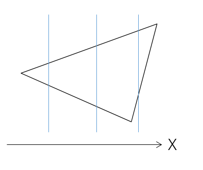</li> 
        <li>X方向ボクセル境界面上の空間IDの取得 
        X方向ボクセル境界面配列をイテレータとしてループ処理を開始する。
        <ol style="list-style-type: lower-roman">
            <li>X方向ボクセル境界面と辺の交点の取得 
            三角ポリゴンとX方向ボクセル境界面の断面の始点、終点を取得するため、X方向境界面と各辺との交点を求める。 
            各辺について、XY平面に投影し、X方向ボクセル境界面との交点①を求める。線指定範囲の空間ID変換（線分）の4.X方向ボクセル境界面と線の交点の取得の処理を行う。 
            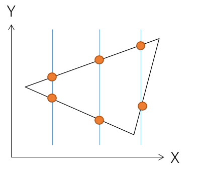  </li>
            <li>交点同士を結んだ線の空間ID取得 
            三角ポリゴンとX方向ボクセル境界面が含まれる空間IDを取得する。 
            交点①のY座標の最大値と最小値を結んだ線を対象に指定範囲の空間ID変換（線分）を行う。 
            X方向ボクセル境界面において、交点が1点のみの場合は、頂点であるため、線として扱わない。 
            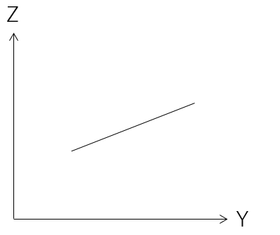  </li>
            </li>
        </ol>
        <li>Y方向ボクセル境界面、Z方向ボクセル境界面処理 
        X方向ボクセル境界面に交わらない辺も考慮するため、Y方向ボクセル境界面、Z方向ボクセル境界面についても境界面を取得する。 
        Ⅲ.X方向ボクセル境界面の取得、Ⅳ.X方向ボクセル境界面上の空間IDの取得の処理を同様にY方向ボクセル境界面、Z方向ボクセル境界面にも行う。  </li>
    </ol>
1. ポリゴン内部の空間IDの取得  
三角形ポリゴンで囲まれた内部の空間IDを取得する。
三角形ポリゴンが重なっている空間ID配列をイテレータとしてループ処理を開始する。
    <ol style="list-style-type: upper-roman">
        <li>内外判定対象空間ID取得 
        内外判定対象空間IDを絞り込む。 
        処理対象要素である空間IDのZ軸方向の1つ上側の空間IDを内外判定対象空間IDとする。内外判定対象空間IDが三角ポリゴンが重なっている空間ID、および内外判定で判定済みの空間IDは対象外とする。  </li>
        <li>簡易確認 
        簡易確認により、内外判定対象空間IDをさらに絞り込む。 
        内外判定対象空間IDから三角ポリゴンが重なっている、もしくは内外判定で判定済みの空間IDまでZ軸方向の上方向に空間IDを取得する。空間IDの状態によって以下のように処理を分岐する
        <table><tr><td>内外判定で内側判定</td><td>内外判定で外側判定</td><td>三角ポリゴンが重なっている</td><td>三角形ポリゴンが重なっている空間IDの最大の高さを超過</td></tr>
        <tr><td>取得した空間IDをすべて内側判定 ループの先頭に戻る</td><td>取得した空間IDをすべて外側判定 ループの先頭に戻る</td><td>以降の処理を継続</td><td>取得した空間IDをすべて外側判定 ループの先頭に戻る</td></tr>
        </table> 
        </li>
        <li>内外判定対象ポリゴンの選定 
        Ⅱ.簡易確認で取得した三角ポリゴンが重なっている空間ID、および左記よりもZ軸方向の上方向の三角ポリゴンが重なっている空間IDを取得し、それぞれが重なる三角形ポリゴンを取得する。  
        </li>
        <li>内外判定 
        内外判定対象空間IDの空間ボクセルの中心点からZ方向にレイを伸ばし、三角形ポリゴンと衝突回数を確認し、内外判定対象空間IDが三角形ポリゴンの内側に存在しているかを確認する。 
        三角形ポリゴンとレイの衝突は以下で判定する。
        三角形ポリゴンの点0点1間のベクトルと点0点2間のベクトルの外積から法線ベクトルを求める。点0と法線から三角形が存在する平面を作成し、Z方向の線分との交点pcを求め、以下の式で内外判定を行う。 
        三角ポリゴンの頂点：p0,p1,p2 <b>
        C1 = (p1 - p0)×(pc - p1) 
        C2 = (p2 - p1)×(pc - p2) 
        C3 = (p0 - p2)×(pc - p0) </b>
        C1・C2 > 0 かつC1・C3 > 0のとき、内側と判定する。 
         
        以下のいずれかが成り立つとき、頂点と衝突したと判定する。 <b>
        p0 = pc 
        p1 = pc 
        p2 = pc 
        </b> 
        以下のいずれかが成り立つとき、辺と衝突したと判定する。 <b>
        |p0 - p1| = |p0 - pc| + |pc - p1| 
        |p1 - p2| = |p1 - p1| + |pc - p2| 
        |p2 - p0| = |p2 - p2| + |pc - p0| 
        </b> 
        以下のものは項目ごとに同じグループとして扱う。2辺衝突、1辺1頂点衝突、2頂点衝突の三角形ポリゴンは、複数グループに所属する。 
        <ul>
            <li>面はそれぞれ1面1グループとする</li>
            <li>交点が同じ、かつ辺と衝突した三角形ポリゴン（ただし、3辺以上の衝突がある場合は、2辺ずつにグループを分ける。詳細は以下に記載）</li>
            <li>交点が同じ、かつ頂点と衝突した三角ポリゴン（ただし、頂点のみの共有で辺を共有していない場合はグループを分ける。詳細は以下に記載）</li>
        </ul>
         
        交点が辺AB上に存在する場合は、以下の処理でグループを分ける。 
        <ol style="list-style-type: none">
        <li>①辺の端点が完全に一致するもの同士に分ける</li>
        <li>②頂点Aを共有する三角形ポリゴンを抽出する</li>
        <li>③取得した三角形ポリゴンの頂点Aを含まない辺を取得する</li>
        <li>④取得した辺（頂点Bを含む辺を除く）の頂点を共有し、連結される三角形ポリゴンをグループ化する</li>
        <li>⑤グループ内の三角形ポリゴンのうち、連結先がない頂点と頂点Bを結ぶ辺を持つ三角形ポリゴンをグループに追加する</li>
        </ol> 
        交点が頂点A上に存在する場合、以下の処理でグループを分ける 
        <ol style="list-style-type: none">
        <li>①頂点Aを共有する三角形ポリゴンを抽出する</li>
        <li>②取得した三角形ポリゴンの頂点Aを含まない辺を取得する</li>
        <li>③取得した辺の頂点を共有し、連結される三角形ポリゴンをグループ化する</li>
        </ol>
        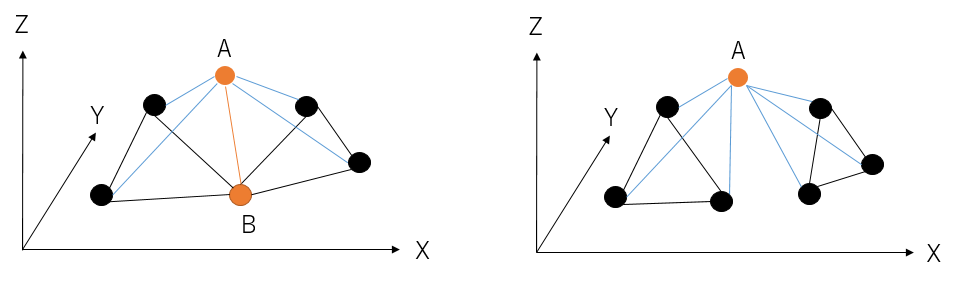  
        内外判定対象空間IDの空間ボクセルの中心点からZ軸方向上方向に線を伸ばした時、ポリゴンとの衝突回数の合計が偶数回の場合は外側判定、奇数回の場合は内側判定とする。判定結果は、簡易確認で取得した空間IDすべてに対して適用する。 
        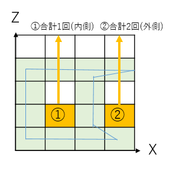 
        衝突回数のカウント条件は、以下の通り。  
        <b>①面との衝突</b> 
            三角形ポリゴンの面との衝突は1回とカウントする。 
            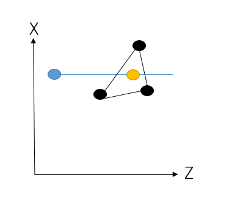 
         
        <b>②1辺との衝突</b> 
            辺と衝突したグループについて、グループに所属する三角形ポリゴンが他のグループに存在しない場合は、同じグループに所属する三角形ポリゴンを対象に処理を行う。  
            複数の辺と衝突したグループに所属する三角形ポリゴンを処理対象外とする。 
            辺と衝突したグループに所属する三角形ポリゴンをそれぞれXY平面に投影したとき、交点が通過する辺に含まれない頂点を判定対象とする。  
            判定対象の頂点が、交点が通過する辺の両側に存在する場合は、1回とカウントする。 
            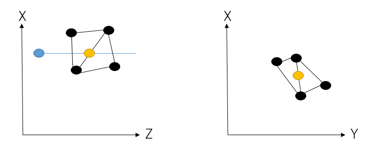 
            判定対象の頂点が、交点が通過する辺の片側に存在する場合はカウントしない。 
            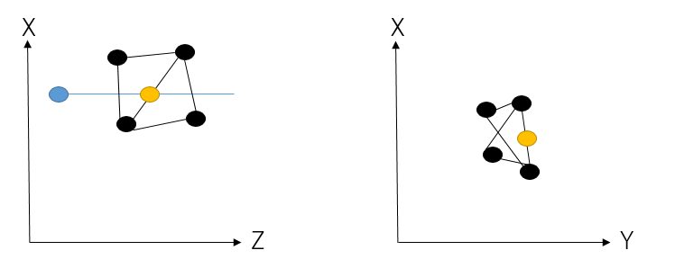 
         
        <b>③2辺との衝突</b> 
             
            辺と衝突したグループについて、グループに所属する三角形ポリゴンが他の辺と衝突したグループに存在する場合（三角形ポリゴンの辺と辺に衝突したケース）は、同じ三角形ポリゴンが所属する辺と衝突したグループの三角形ポリゴンと同時に処理を行う。 
            このとき、同時に処理を行うグループに対しても他の辺、または頂点と衝突したグループに存在していないか確認し、存在していれば、同時に処理を行う。 頂点と衝突したグループに存在している場合は、⑤1辺1頂点との衝突の処理を行う。
              
            ②1辺との衝突と同様に辺と衝突したグループを対象に判定対象を求める。 
             
            判定対象の頂点が、交点が通過する辺の両側に存在する場合は、1回とカウントする。 
            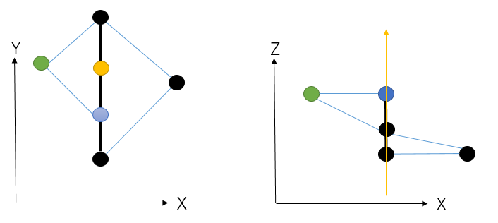 
            判定対象の頂点が、交点が通過する辺の片側に存在する場合はカウントしない。 
            また、同時に処理したグループは、再度衝突確認の処理を行わない。 
         
        <b>④2頂点との衝突</b> 
            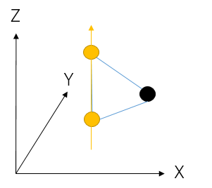 
            頂点と衝突したグループについて、グループに所属する三角形ポリゴンが頂点と衝突したグループに存在する場合（三角形ポリゴンの頂点と頂点に衝突したケース）は、同じ三角形ポリゴンが所属する頂点と衝突したグループの三角形ポリゴンと同時に処理を行う。 
            このとき、同時に処理を行うグループに対しても他の辺、または頂点と衝突したグループに存在していないか確認し、存在していれば、同時に処理を行う。 辺と衝突したグループに存在している場合は、⑤1辺1頂点との衝突の処理を行う。  
            頂点と衝突したグループの三角形ポリゴンのうち、複数グループに含まれる三角ポリゴンを一つを抽出し、XY平面に投影する。交点として重なる2点を1点として集約した点ともう1つの点を通る直線を直線Lとする。 
            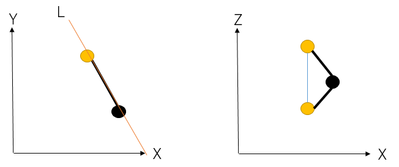  
            複数の頂点と衝突したグループに所属する三角形ポリゴンがある場合、グループをマージする。 
            点と衝突したグループに所属する三角形ポリゴンの頂点である交点が含まれない辺をそれぞれXY平面に投影したとき、投影した辺と直線Lとの交点CXを求める。 
            交点CXが直線L上で交点に対し、前後の両方に存在しない場合は、判定対象の頂点なしとする。 
            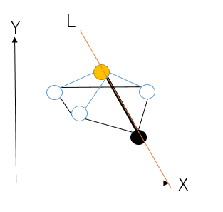 
            交点CXの前後に交差した辺を持つ三角形ポリゴンが同じグループに所属している場合は、交点CX上を通る辺から連結される辺をたどっていく。前後逆側の点に到達した場合は、間の辺の頂点を判定対象とする。ただし、辺の開始頂点と終了頂点は判定対象に含めない。 
            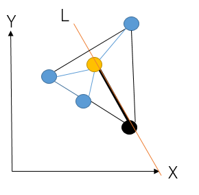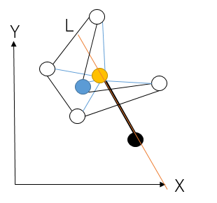 
            逆順でも同様に連結する辺をたどって、判定対象の頂点を求める。 
             
            判定対象の頂点が、直線Lの両側に存在する場合は、1回とカウントする。 
            判定対象の頂点が、直線Lの片側に存在する場合はカウントしない。 
            また、同時に処理したグループは、再度衝突確認の処理を行わない。 
         
        <b>⑤1辺1頂点との衝突</b> 
             
            辺と衝突したグループについて、グループに所属する三角形ポリゴンが頂点と衝突したグループに存在する場合（三角形ポリゴンの辺と頂点に衝突したケース）は、同じ三角形ポリゴンが所属する頂点と衝突したグループの三角形ポリゴンと同時に処理を行う。 
            このとき、同時に処理を行うグループに対しても他の辺、または頂点と衝突したグループに存在していないか確認し、存在していれば、同時に処理を行う。  
            ②1辺との衝突と同様に辺と衝突したグループを対象に判定対象の頂点を求める。  
            交点が通過する辺を延長した直線を直線Lとする。  
            直線Lに対し、④2頂点との衝突と同様に判定対象の頂点を求める。 
             
            判定対象の頂点が、直線Lの両側に存在する場合は、1回とカウントする。 
            判定対象の頂点が、直線Lの片側に存在する場合はカウントしない。 
            また、同時に処理したグループは、再度衝突確認の処理を行わない。 
         
        <b>⑥1頂点との衝突</b> 
            頂点と衝突したグループについて、他のグループに存在しない場合は、同じグループに所属する三角形ポリゴンを対象に処理を行う。 
            同グループの三角形ポリゴンをXY平面に投影したとき、交差した頂点が交差した頂点を含まない辺の多角形の中に含まれる場合は、1回とカウントする。 
            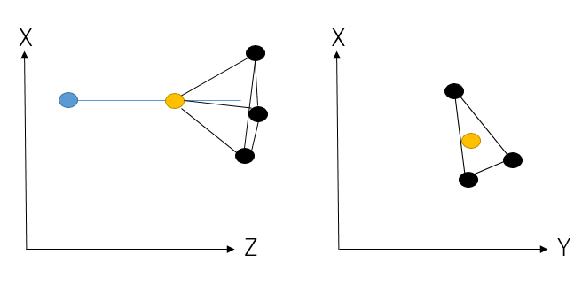 
            交差した頂点が多角形の中に含まれない場合はカウントしない。
            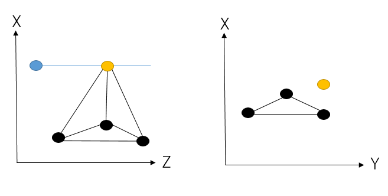 
            2次元の内外判定はWinding Number Algorithmを用いて判定する。XY平面に投影したときの交差点と頂点を共有する三角形ポリゴンの頂点を結んだ線における、隣り合う線との角度の和を求める。0になる場合は外側、それ以外は内側と判定する。 
            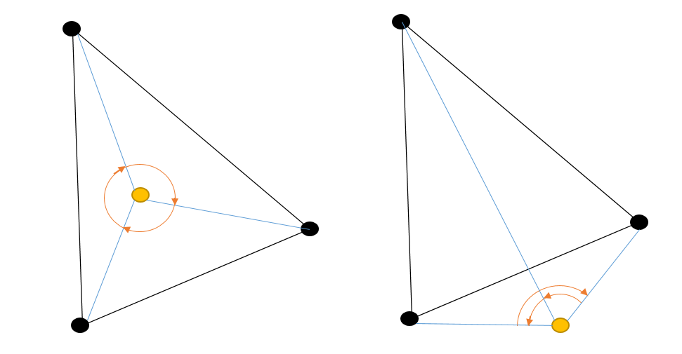 
         
        </li>
    </ol>
1. 有効な空間IDの取得
三角形ポリゴンが重なる空間ID、および内側と判定された空間IDを有効な空間IDから重複がない状態のものを有効な空間IDとする。  
1. 除外する空間IDの取得
3.ポリゴン内部の空間IDの取得、4.有効な空間IDの取得と同様に除外対象の三角形ポリゴン配列について、重なる重なる空間ID、および内側と判定された空間IDを取得し、重複がない状態のものを除外する空間IDとする。  
1. 返却値の設定
有効な空間IDから除外する空間IDを除外したものを返却する。  

### 制限事項
- ポリゴンを構成する辺の端点は西側から東側に繋いだ線分として解釈する
- 三角ポリゴンが重なっている面に対し、内外判定における空間ボクセルの中心からZ軸方向上方向に伸ばした線がぶつかる場合、内外が逆に判定される場合がある

## 指定範囲の空間ID変換（線分）

### 更新履歴 
<table border=1>
<header>
<td width=13%>
版数
</td>
<td width=10%>
日付
</td>
<td>
概要
</td>
<td width=18%>
更新者
</td>
</header>
<tr>
<td>0.01</td>
<td>2022/06/09</td>
<td>新規作成</td>
<td>田中</td>
</tr>
<tr>
<td>0.02</td>
<td>2022/06/21</td>
<td>
<ul>
<li>水平方向精度のボクセルの大きさ取得を削除</li>
<li>垂直方向精度のボクセルの大きさ取得を削除</li>
<li>始点終点の座標変換を追加</li>
<li>ボクセル境界面を軸平行から緯度経度平行に変更</li>
<li>線上のボクセル境界面を無視する記述を削除</li>
</ul>
</td>
<td>田中</td>
</tr>
<tr>
<td>0.03</td>
<td>2022/06/28</td>
<td>
<ul>
<li>処理概要を記載</li>
<li>制限事項を記載</li>
<li>処理順序に改行を追加</li>
<li>更新履歴の順序を変更</li>
</ul>
</td>
<td>田中</td>
</tr>
<tr>
<td>0.04</td>
<td>2022/06/29</td>
<td>
<ul>
<li>CRSの計算式について、文言のみ修正</li>
</ul>
</td>
<td>田中</td>
</tr>
<tr>
<td>0.05</td>
<td>2022/07/19</td>
<td>
<ul>
<li>空間IDで使用する座標を3857に変更</li>
<li>緯度経度高さでの分割からXYZでの分割へ変更</li>
</ul>
</td>
<td>田中</td>
</tr>
<tr>
<td>0.06</td>
<td>2022/07/19</td>
<td>
<ul>
<li>境界面を2次元上の線分ではなく平面に変更</li>
</ul>
</td>
<td>田中</td>
</tr>
<tr>
<td>0.07</td>
<td>2022/08/08</td>
<td>
<ul>
<li>中点をそすべてのボクセル境界面を対象として取得するように修正</li>
</ul>
</td>
<td>田中</td>
</tr>
<tr>
<td>0.08</td>
<td>2022/08/9</td>
<td>
<ul>
<li>参照先の節タイトルを記載</li>
</ul>
</td>
<td>田中</td>
</tr>
<tr>
<td>0.09</td>
<td>2022/08/9</td>
<td>
<ul>
<li>中点の取得対象を始点、終点、交点に変更</li>
</ul>
</td>
<td>田中</td>
</tr>
</tr>
<tr>
<td>0.10</td>
<td>2022/08/10</td>
<td>
<ul>
<li>制限事項を追加</li>
</ul>
</td>
<td>田中</td>
</tr>
<tr>
<td>0.10</td>
<td>2022/08/19</td>
<td>
<ul>
<li>頂点を通過した際の考え方を追記</li>
<li>処理の目的を追記</li>
</ul>
</td>
<td>田中</td>
</tr>
</table>

### 処理概要
入力として、始点、終点、CRS、水平精度、垂直精度が与えられる。
始点と終点間の線分が重なる空間IDを取得する。
頂点を通過した場合は、それぞれプラス方向の空間ボクセルに含まれるものとする。
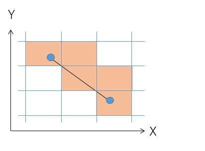 
### 処理順序
1. 始点、終点の空間ID取得
指定点から空間IDへの変換(点群)を用いて入力された始点、終点から空間IDを取得する。
ここで取得した空間IDはボクセル境界面を取得するために使用する。
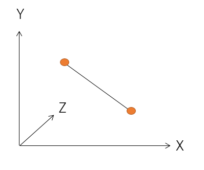  
1. 始点終点の座標変換
地理座標から投影座標への変換を用いて、入力された始点、終点に対し、入力されたCRSの座標系から空間IDで使用する座標系(EPSG:3857)に座標変換する。  
1. X方向ボクセル境界面の取得
X方向ボクセル境界面と線の交点を空間ID変換対象の点として抽出するため、まずはX方向ボクセル境界面を取得する。
始点と終点間の X方向ボクセル境界面を取得する。 X方向ボクセル境界面は複数個存在する場合もある。
X方向における始点と終点間の空間IDのボクセル頂点からX座標を抜き出し、X方向ボクセル境界面とする。  
1. X方向ボクセル境界面と線の交点の取得
線とボクセルの重なりを判定するため、境界上の点（交点）を空間ID変換対象の点として取得する。
ボクセル境界配列をイテレータとして、ループ処理を開始する。 
    <ol style="list-style-type: upper-roman">
        <li>ボクセル境界と線の交点の取得 
        X方向ボクセル境界面と線の交点を取得する。 
        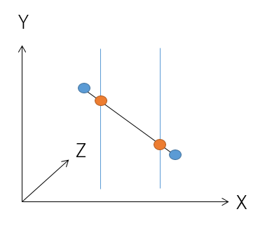  
        </li>
    </ol>
1. Y方向ボクセル境界面の取得
X方向ボクセル境界面に交わらない線分も考慮するため、Y方向ボクセル境界面についても境界面を取得する。
始点と終点間のY方向ボクセル境界面を取得する。Y方向ボクセル境界面は複数個存在する場合もある。
Y方向における始点と終点間の空間IDのボクセル頂点からY座標を抜き出し、Y方向ボクセル境界面とする。  
1. Y方向ボクセル境界面と線の交点の取得
X方向ボクセル境界面に交わらない線分も考慮するため、Y方向ボクセル境界面との交点も空間ID変換対象の点として取得する。
4.X方向ボクセル境界面と線の交点の取得と同様にループ処理の中で交点を求める。  
1. Z方向ボクセル境界面の取得
X方向ボクセル境界面、Y方向ボクセル境界面に交わらない線分も考慮するため、Z方向ボクセル境界面との交点も取得する。
始点と終点間のZ方向ボクセル境界面を取得する。Z方向ボクセル境界面は複数個存在する場合もある。
Z方向における始点と終点間の空間IDのボクセル頂点からZ座標を抜き出し、Z方向ボクセル境界面とする。  
1. Z方向ボクセル境界面と線の交点の取得
X方向ボクセル境界面、Y方向ボクセル境界面に交わらない線分も考慮するため、Z方向ボクセル境界面との交点も空間ID変換対象の点として取得する。
4.X方向ボクセル境界面と線の交点の取得と同様にループ処理の中で交点を求める。  
1. 中点の取得
交点が空間ボクセルに対し、マイナス方向を通過してる場合を考慮して、空間ID変換対象の点として取得する。
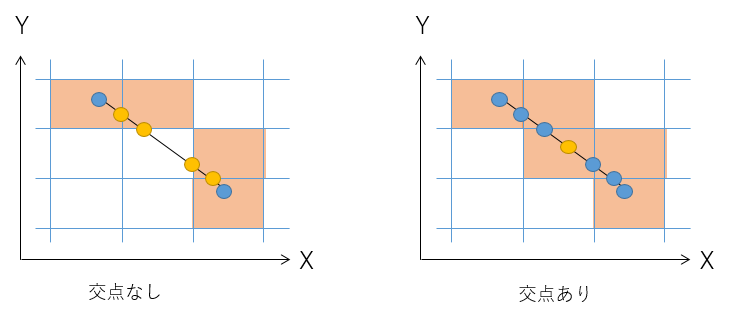
始点、終点、X方向ボクセル境界面、Y方向ボクセル境界面、Z方向ボクセル境界面の交点と交点の中点を求める。  
1. 交点と中点の空間IDの取得
地理座標から投影座標への変換を用いてX方向ボクセル境界面、Y方向ボクセル境界面、Z方向ボクセル境界面の交点と中点を緯度経度(EPSG:4326)に変換後、指定点から空間IDへの変換(点群)を用いて空間IDに変換する。座標変換に失敗した場合は例外を呼び出し元に投げる。  
1. 返却値の設定
取得した空間IDを重複がない状態で返却する。

### 制限事項
- 線分は端点を西側から東側に繋いだ線分として解釈する

## 使用ライブラリ

### 更新履歴 
<table border=1>
<header>
<td width=13%>
版数
</td>
<td width=10%>
日付
</td>
<td>
概要
</td>
<td width=18%>
更新者
</td>
</header>
<tr>
<td>0.01</td>
<td>2022/06/09</td>
<td>新規作成</td>
<td>田中</td>
</tr>
<tr>
<td>0.02</td>
<td>2022/06/21</td>
<td>
<ul>
<li>pyprojectを追加</li>
<li>numpyを追加</li>
<li>scikit-spatialを追加</li>
</ul>
</td>
<td>田中</td>
</tr>
</tr>
<tr>
<td>0.03</td>
<td>2022/06/29</td>
<td>
<ul>
<li>pyprojectをpyprojに修正</li>
</ul>
</td>
<td>田中</td>
</tr>
</table>

- pyproj
    - バージョン:3.3.1
    - pythonバージョン:&gt;=3.8
    - 確認日:2022/6/21
    - 座標変換に使用する
- numpy  
    - バージョン:1.22.4 
    - pythonバージョン:&gt;=3.8
    - 確認日:2022/6/21
    - 行列演算に使用する
- scikit-spatial  
    - バージョン:6.4.0
    - pythonバージョン:&gt;=3.7
    - 確認日:2022/6/21
    - 線分の演算に使用する
