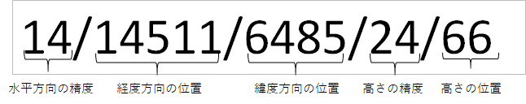
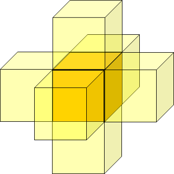
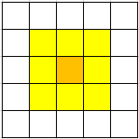
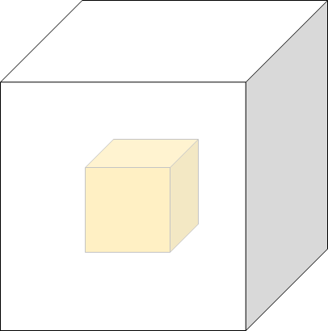

# 設計資料    

本資料ではshifting_spatial_idモジュール内で提供される下記関数について記載をする。  
- 指定の数値分、移動した場合の空間IDを取得
- 空間IDの面に直接、接している6個の空間IDの取得
- 空間IDの水平方向の周囲、一周分の8個の空間IDを取得
- 空間IDを囲う26個の空間IDを取得

## 指定の数値分、移動した場合の空間IDを取得

### 更新履歴 
<table border=1>
<header>
<td width=13%>
版数
</td>
<td width=10%>
日付
</td>
<td>
概要
</td>
<td width=18%>
更新者
</td>
</header>
<tr>
<td>0.01</td>
<td>2022/06/03</td>
<td>新規作成</td>
<td>嶋津</td>
</tr>
<tr>
<td>0.02</td>
<td>2022/06/27</td>
<td>処理概要の追加</td>
<td>嶋津</td>
</tr>
<tr>
<td>0.03</td>
<td>2022/07/22</td>
<td>ライブラリ未使用になったため、記載を削除</td>
<td>嶋津</td>
</tr>
</table>

### 処理概要
緯度、経度、高さ方向の移動距離を指定する。入力された空間IDがその距離分移動した先の空間IDを取得する。

### 処理順序

1. 空間IDの分解  
入力された空間IDから経度の位置、緯度の位置、高さの位置を取得する。  

1. 各方向の移動先の位置の取得  
    <B>
    経度方向の移動先: 経度の位置 + 入力された移動距離 
    緯度方向の移動先: 緯度の位置 + 入力された移動距離 
    高さ方向の移動先: 高さの位置 + 入力された移動距離 
    </B>

1. 移動先の位置が(2^精度-1)を超えている場合、「移動先の位置 % 2^精度」の値を移動先とする。

1. 空間IDの生成  
移動先の位置を空間IDとして返却する。  
※精度は同じ。

## 空間IDの面に直接、接している6個の空間IDの取得

### 更新履歴 
<table border=1>
<header>
<td width=13%>
版数
</td>
<td width=10%>
日付
</td>
<td>
概要
</td>
<td width=18%>
更新者
</td>
</header>
<tr>
<td>0.01</td>
<td>2022/06/03</td>
<td>新規作成</td>
<td>嶋津</td>
</tr>
<tr>
<td>0.02</td>
<td>2022/06/27</td>
<td>処理概要の追加</td>
<td>嶋津</td>
</tr>
<tr>
<td>0.03</td>
<td>2022/07/22</td>
<td>ライブラリ未使用になったため、記載を削除</td>
<td>嶋津</td>
</tr>

</table>

### 処理概要
入力された空間IDを中心に、上下、左右、手前奥の計6個の空間IDを取得する。

### 処理順序
1. 空間IDの分解  
入力された空間IDから経度の位置、緯度の位置、高さの位置を取得する。  
取得は下記のようなイメージになる。

1. 下記の6個の空間IDを取得  
    <B>
    経度方向に +1 した空間ID 
    経度方向に -1 した空間ID 
    緯度方向に +1 した空間ID 
    緯度方向に -1 した空間ID 
    高さ方向に +1 した空間ID 
    高さ方向に -1 した空間ID 
    </B>

1. 空間IDの生成  
移動先の位置を空間IDとして返却用リストに格納し返却する。  
※精度は同じ。

## 空間IDの水平方向の周囲、一周分の8個の空間IDを取得

### 更新履歴 
<table border=1>
<header>
<td width=13%>
版数
</td>
<td width=10%>
日付
</td>
<td>
概要
</td>
<td width=18%>
更新者
</td>
</header>
<tr>
<td>0.01</td>
<td>2022/06/03</td>
<td>新規作成</td>
<td>嶋津</td>
</tr>
<tr>
<td>0.02</td>
<td>2022/06/27</td>
<td>処理概要の追加</td>
<td>嶋津</td>
</tr>
<tr>
<td>0.03</td>
<td>2022/07/22</td>
<td>ライブラリ未使用になったため、記載を削除</td>
<td>嶋津</td>
</tr>

</table>

### 処理概要
入力された空間IDを中心に、左右、手前奥、水平面の対角線上の先の計8個の空間IDを取得する。
取得は下記のようなイメージになる。

### 処理順序
1. 空間IDの分解  
入力された空間IDから経度の位置、緯度の位置、高さの位置を取得する。  

1. 下記の8個の空間IDを取得  
    <B>
    経度方向に +1 した空間ID 
    経度方向に -1 した空間ID 
    緯度方向に +1 した空間ID 
    緯度方向に -1 した空間ID 
    経度方向に +1、緯度方向に -1 した空間ID 
    経度方向に -1、緯度方向に -1 した空間ID 
    経度方向に +1、緯度方向に +1 した空間ID 
    経度方向に -1、緯度方向に +1 した空間ID 
    </B>  

1. 空間IDの返却  
取得した8個の空間IDを返却用リストに格納して返却する。

## 空間IDを囲う26個の空間IDを取得

### 更新履歴 
<table border=1>
<header>
<td width=13%>
版数
</td>
<td width=10%>
日付
</td>
<td>
概要
</td>
<td width=18%>
更新者
</td>
</header>
<tr>
<td>0.01</td>
<td>2022/06/03</td>
<td>新規作成</td>
<td>嶋津</td>
</tr>
<tr>
<td>0.02</td>
<td>2022/06/27</td>
<td>処理概要の追加</td>
<td>嶋津</td>
</tr>
<tr>
<td>0.03</td>
<td>2022/07/22</td>
<td>ライブラリ未使用になったため、記載を削除</td>
<td>嶋津</td>
</tr>

</table>

### 処理概要
入力された空間IDを中心として、面、辺、頂点のいずれかが接する計26個の空間IDを取得する。
下記のように空間IDを中心としてその周囲の空間IDを取得するイメージになる。

### 処理順序
1. 空間IDの分解  
空間IDから経度の位置、緯度の位置、高さの位置を取得  

1. 下記の26個の空間IDを取得  
    <B>
    高さ方向に +1 した空間ID 
    経度方向に +1、高さ方向に +1 した空間ID 
    経度方向に -1、高さ方向に +1 した空間ID 
    緯度方向に +1、高さ方向に +1 した空間ID 
    緯度方向に -1、高さ方向に +1 した空間ID 
    経度方向に +1、緯度方向に -1、高さ方向に +1 した空間ID 
    経度方向に -1、緯度方向に -1、高さ方向に +1 した空間ID 
    経度方向に +1、緯度方向に +1、高さ方向に +1 した空間ID 
    経度方向に -1、緯度方向に +1、高さ方向に +1 した空間ID 
     
    経度方向に +1 した空間ID 
    経度方向に -1 した空間ID 
    緯度方向に +1 した空間ID 
    緯度方向に -1 した空間ID 
    経度方向に +1、緯度方向に -1 した空間ID 
    経度方向に -1、緯度方向に -1 した空間ID 
    経度方向に +1、緯度方向に +1 した空間ID 
    経度方向に -1、緯度方向に +1 した空間ID 
     
    高さ方向に -1 した空間ID 
    経度方向に +1、高さ方向に -1 した空間ID 
    経度方向に -1、高さ方向に -1 した空間ID 
    緯度方向に +1、高さ方向に -1 した空間ID 
    緯度方向に -1、高さ方向に -1 した空間ID 
    経度方向に +1、緯度方向に -1、高さ方向に -1 した空間ID 
    経度方向に -1、緯度方向に -1、高さ方向に -1 した空間ID 
    経度方向に +1、緯度方向に +1、高さ方向に -1 した空間ID 
    経度方向に -1、緯度方向に +1、高さ方向に -1 した空間ID 
    </B>

1. 空間IDの返却  
取得した26個の空間IDを返却用リストに格納して返却する。

## 制約事項

### 更新履歴 
<table border=1>
<header>
<td width=13%>
版数
</td>
<td width=10%>
日付
</td>
<td>
概要
</td>
<td width=18%>
更新者
</td>
</header>
<tr>
<td>0.01</td>
<td>2022/8/022</td>
<td>
制約事項に更新履歴の追加 
</td>
<td>
嶋津
</td>
</tr>
</table>

<ul>
<li>
特定の空間IDの周囲の空間IDを取得する場合、取得先の空間IDのインデックスが精度の範囲の限界を超えることがある。その場合、「指定の数値分、移動した場合の空間IDを取得」の関数と同様に空間IDを扱う。
</li>
</ul>

## 使用ライブラリ

### 更新履歴 
<table border=1>
<header>
<td width=13%>
版数
</td>
<td width=10%>
日付
</td>
<td>
概要
</td>
<td width=18%>
更新者
</td>
</header>
<tr>
<td>0.01</td>
<td>2022/06/03</td>
<td>新規作成</td>
<td>嶋津</td>
</tr>

</table>

・なし